# Training model & objective of the tutorial
 Deploying - Training - saving model - having a web page.

# Framework

The architecture is splited into 3 instances
* to avoid for example interuption in the production (update,...)
* to have more flexibility

So we need to create 3 AWS instances "Deep Learning Base AMI (Ubuntu 16.04) Version 21.0 - ami-045565871c0771faf" into our VPC:
1. public instances - Ubuntu (instance for training the model) - between 15 to 20 Gigabyte,
1. public instances - Ubuntu (Front end),
1. public instances - Ubuntu (Back end).

The **front end** interacts with the user, gathers all it needs and send it to the back end.
The **back end** computes and send back information to the front end to be displayed to the end user.

# Database and files used

We are going to use the MNIST database developped by Yann LeCun. It is a dataset composed of 60000 examples of written numbers (from 0 to 9). We will have 60 examples as our test set.

The text file called **requirement.txt** contains the list of the packages and the version we need.

## First instance - Machine number 1

This instance is used to train the model. We will need to:
* install Anaconda
* install Jupyter (Jupyter Notebook),
* train our model (provided),
* save our model,
* create a virtual environment.

We will use Keras and Tensorflow 1.8. Once the model is trained and saved we can shut our instance down.

 **Tensorflow** is the main framework in deeplearning. **Keras** is a meta framework which helps to facilitate the coding (in a syntax point of view) and interface with Tensorflow.

Connect to the instance and type the code Herebelow:

```
wget https://repo.anaconda.com/archive/Anaconda3-2019.03-Linux-x86_64.sh
sudo bash Anaconda3-2019.03-Linux-x86_64.sh #Answer yes to all questions
export PATH=~/anaconda3/bin:$PATH #If conda command is not found after installation

jupyter notebook --ip=0.0.0.0 --no-browser

conda create -n nameofyourenv python=3.6
conda install nb_conda "This needs to be done outside your virtual env

conda activate nameofyourenv
conda install ipykerne
ipython kernel install --user --name=nameyouwanttodisplay

#Here you are in your virtual environment
#What you need to install
#AT LEAST
#Keras (don't mind the version)
#Tensorflow 1.8
pip install --upgrade tensorflow

sudo apt-get install git
git clone https://github.com/leodsti/AWS_Tutorials.git
pip install -r AWS_Tutorials/MNIST/requirements.txt

```
Open and execute the following notebook called 00-mnist-cnn.ipynb for training our model which tries to predict 10 classes:

Image are pictures 28*28 pixels (multi dimensional arrays):
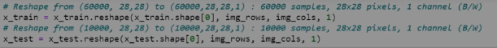

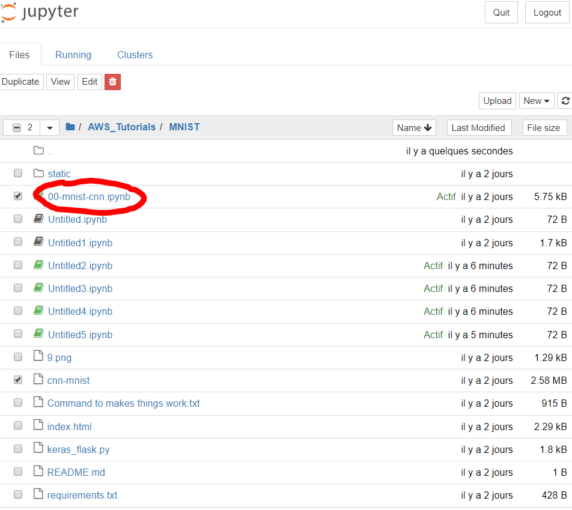

The output file is called: cnn-mnist (2.58 MB).

## Second instance  - Machine number 2

This instance is the webserver (web app) used as the "front end". We will need to:
* install the webserver,
* deploy the files in the right place,
* install **Apache server** & httpd.
* test if it works.

```
sudo apt-get update
sudo apt-get install yum
sudo yum update -y
sudo service httpd start
sudo yum -y install httpd
sudo apt install apache2
sudo ufw app list

sudo systemtl status apache2

sudo apt-get install git
git clone https://github.com/leodsti/AWS_Tutorials.git

" copy at the right place the "index.html" file (ie. document root).
~/AWS_Tutorials/MNIST$ sudo mv index.html /var/www/html/

"Commands to know: for deleteting a directory : rm -rf /nom-repertoire

```

Here below the figure representing the Apache webserver (reached using the following address http://34.229.180.22/) opened and installed:

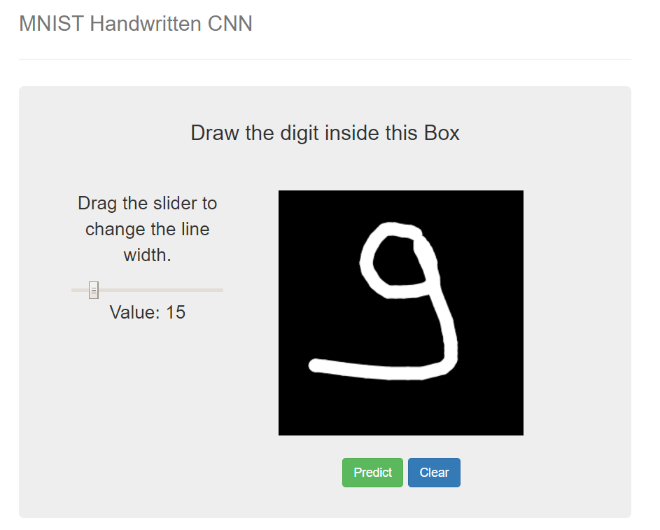

As our Public IP is not an elastic IP, each time the instance is stopped & restart the public IP is changed.

### Security Group & port choice

The port that must be opened is: 80 (HTTP)

### Changing the IP of the backend in the index.html file with Frontend

Indeed as we said, our Public IP is not an elastic IP, each time the instance is stopped & restart the public IP is changed. so we need to update this IP into the index.html file.

```
sudo vi index.html

# Type “I” to insert text- Put the IP number of the backend Instance (in the url field)
# then controle C and echap
# type the command :wq to write and quit
:wq

```
Here below a figure representing the opened file using the VI_editor

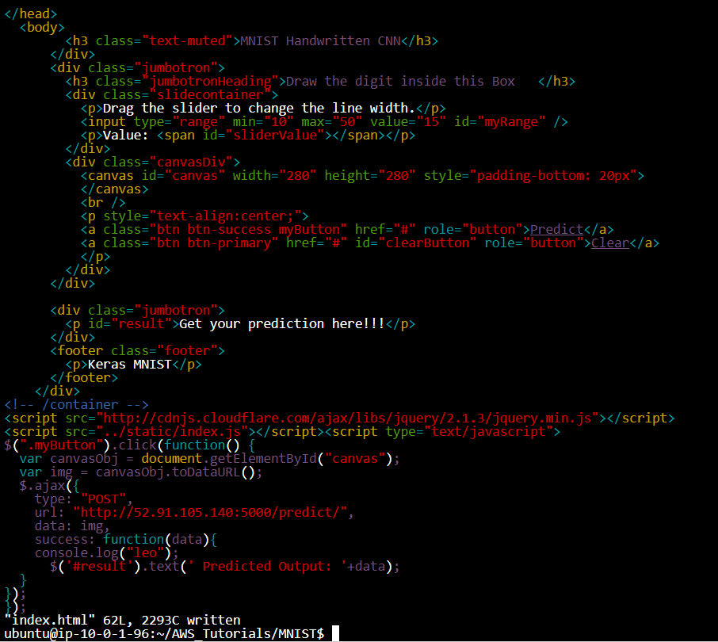


## Third instance (Flask (equivalent of NodeJS)) - Application server - Machine number 3

This instance is used as the "back end". This last instance do the prediction. It is our application. Our model is saved in our Backend. Our instance is installed into the public subnet but without a public IP.

In this instance, we need to install **opencv** to execute "keras_flask.py" file.

```
wget https://repo.anaconda.com/archive/Anaconda3-2019.03-Linux-x86_64.sh
sudo bash Anaconda3-2019.03-Linux-x86_64.sh #Answer yes to all questions
export PATH=~/anaconda3/bin:$PATH #If conda command is not found after installation

conda create -n nameofyourenv python=3.6
conda install nb_conda "This needs to be done outside your virtual env

sudo apt-get update
sudo apt-get install python3-opencv

sudo apt-get update
pip install flask

sudo apt-get update
pip install imageio

sudo apt-get install git
git clone https://github.com/leodsti/AWS_Tutorials.git

pip install -r AWS_Tutorials/MNIST/requirements.txt

conda activate nameofyourenv
cd AWS_Tutorials/MNIST
python3 keras_flask.py
```

As our **Public IP** is not an elastic IP, each time the instance is stopped & restarted the public IP is changed. We need to update the backend public IP address indicated into the "index.html" file within the frontend instance before using the application.

Some modifications have been done on the keras_flask.py file to solve few issues. Here below the various modifications done indicated by a red line:

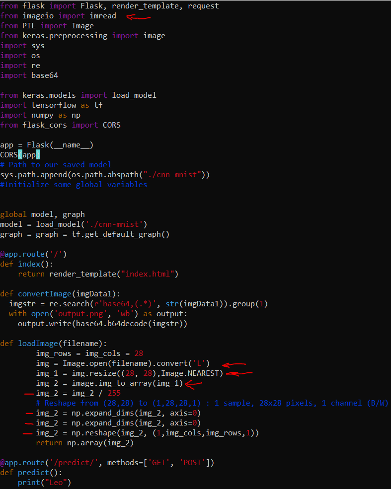

# Results of predictions realized from the frontend

## Number 1
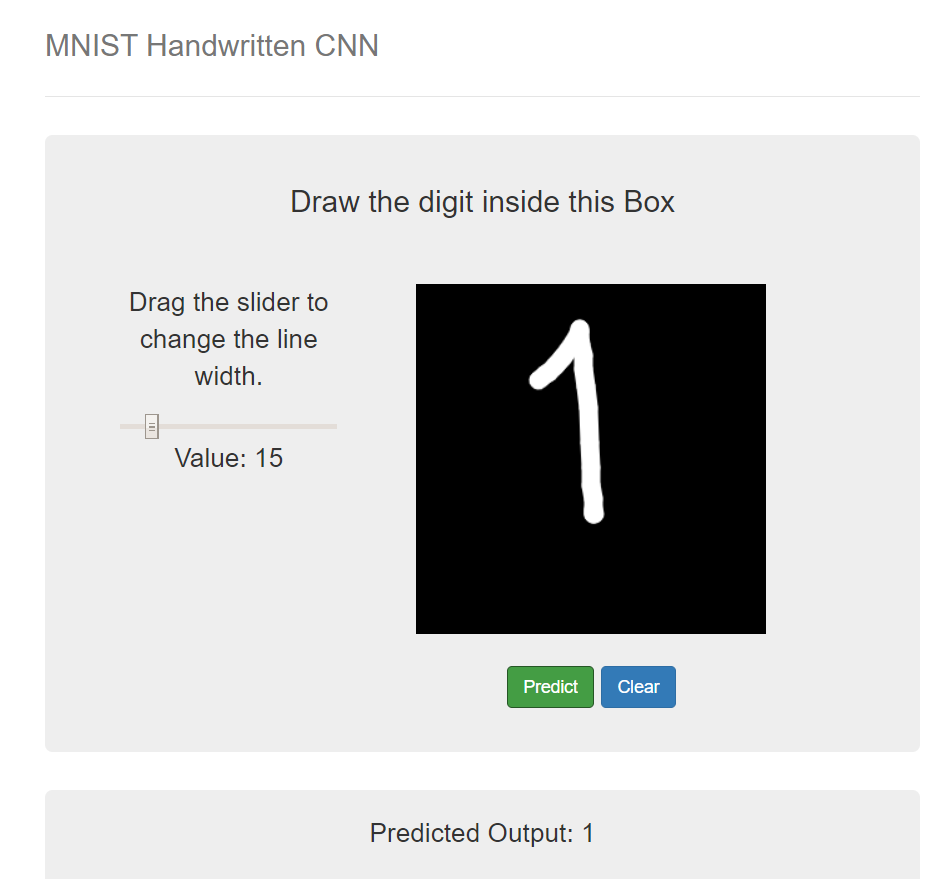

The model is able to recognize the number.

## Number 2
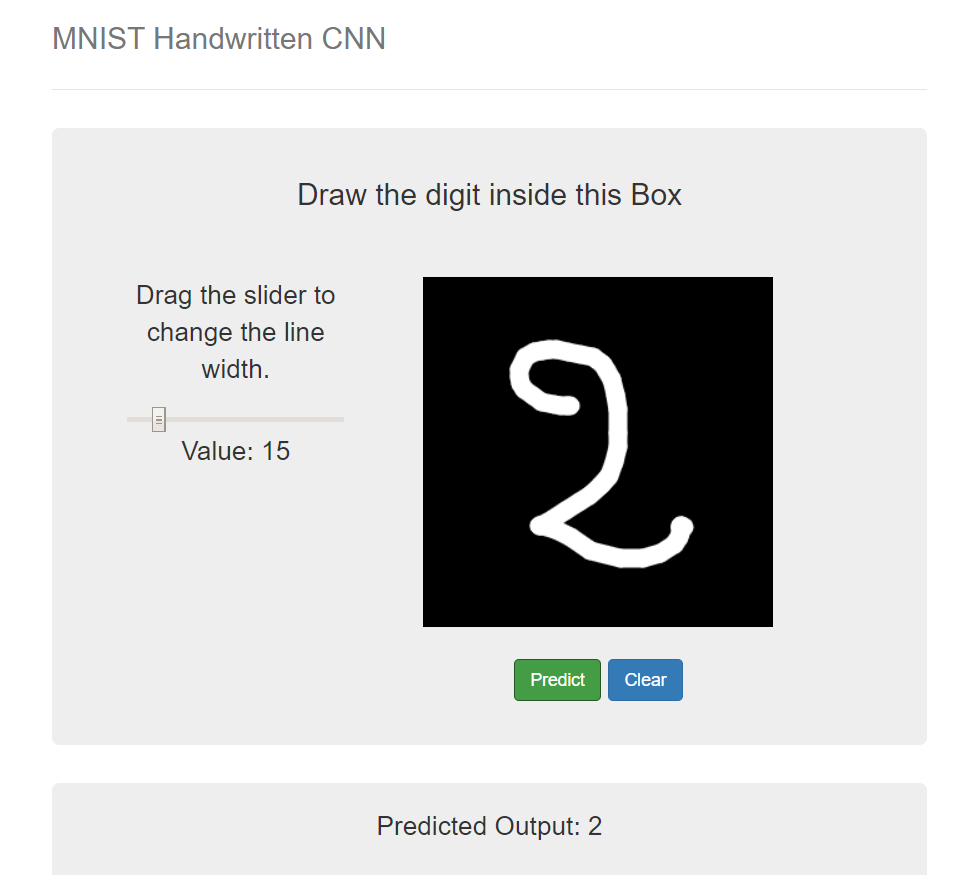

The model is able to recognize the number.

## Number 3
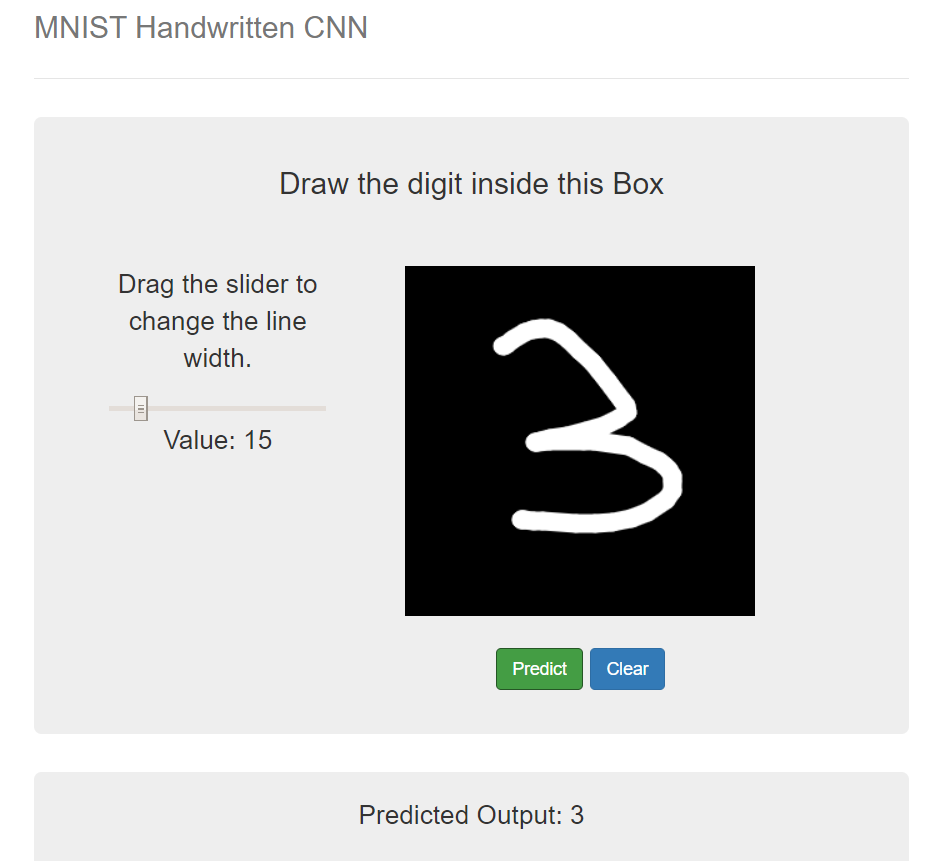

The model is able to recognize the number.

## Number 4


The model is able to recognize the number.

## Number 5
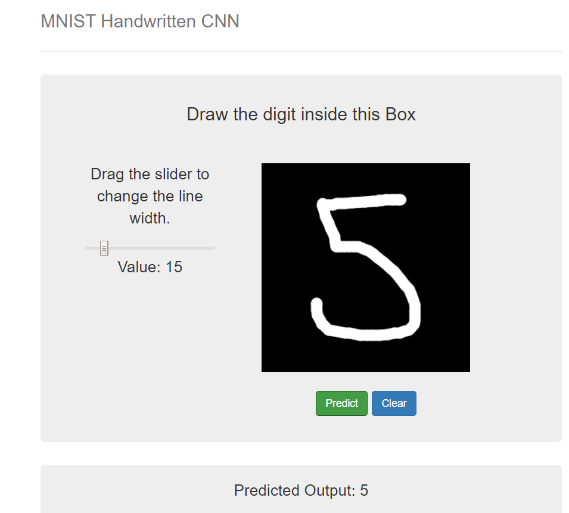

The model is able to recognize the number.

## Number 6
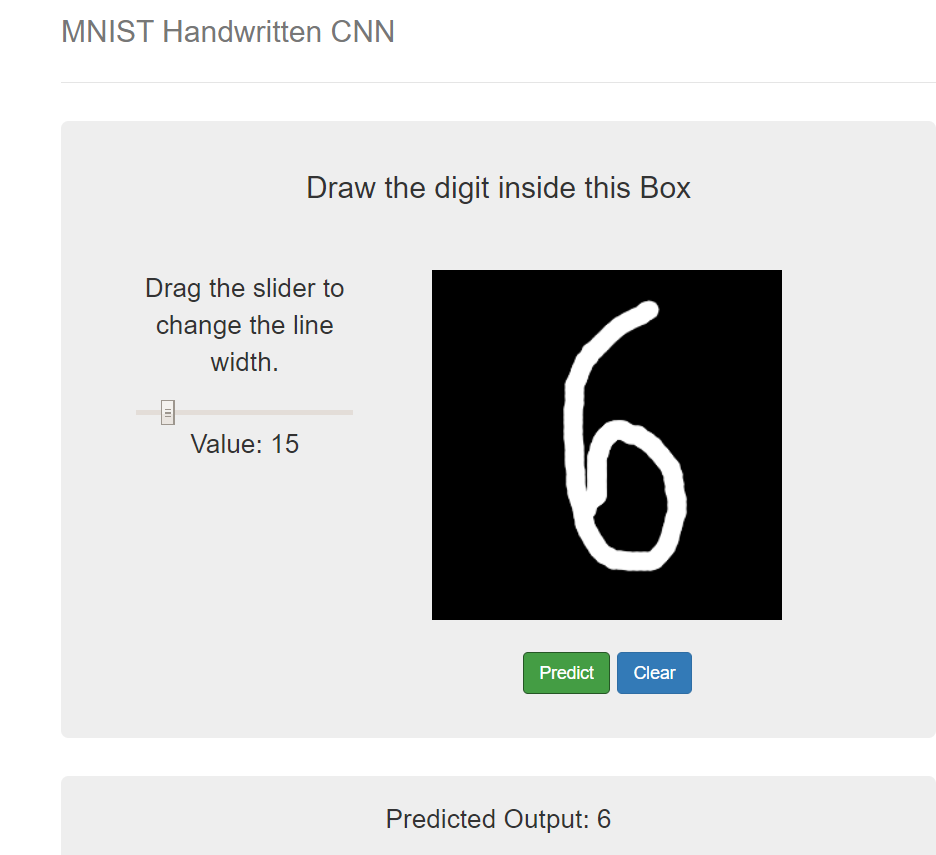

The model is able to recognize the number.

## Number 7
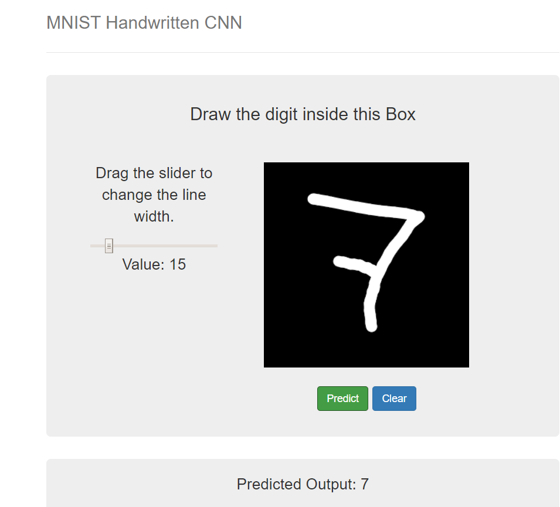

The model is able to recognize the number.

## Number 8
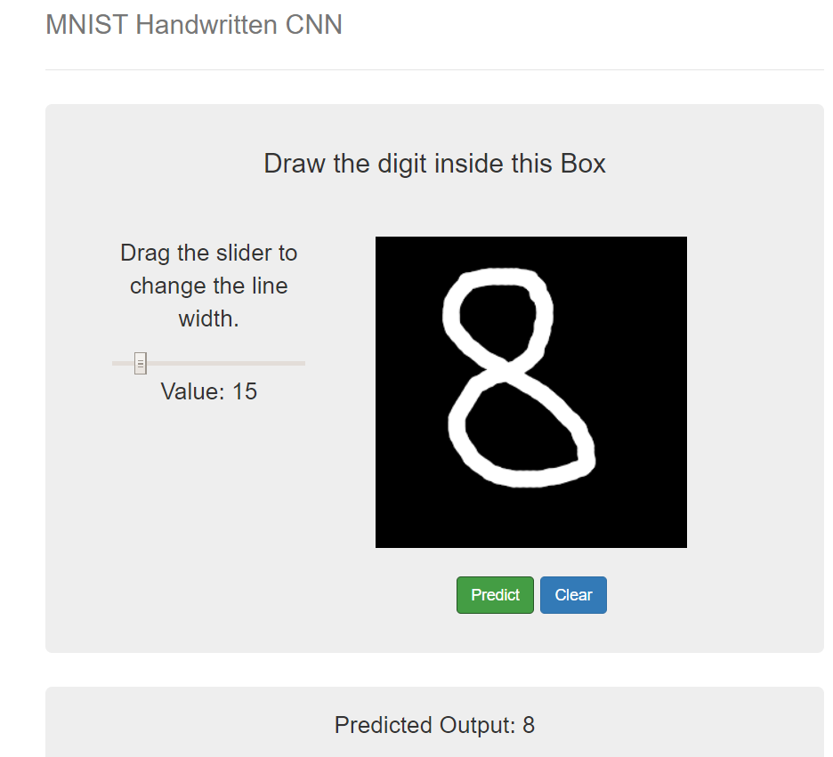

The model is able to recognize the number.

## Number 9
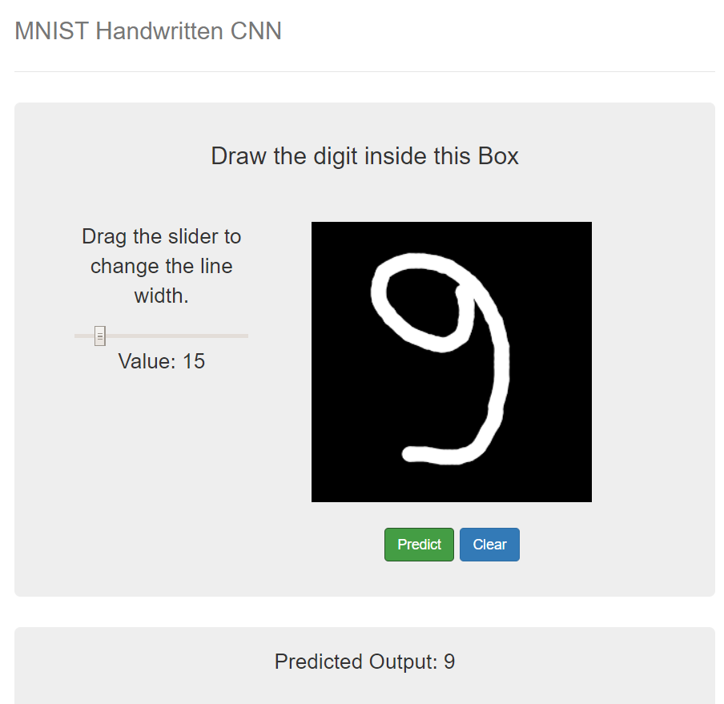

The model is able to recognize the number.
